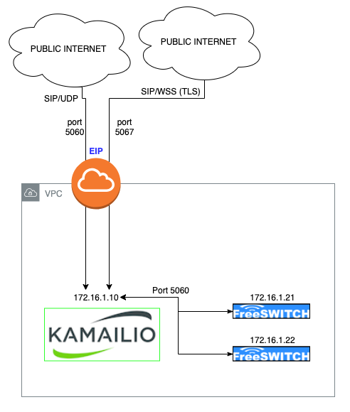

# kamailio-public-private
Configuration for a Kamailio in a Public/Private network.

I'm posting this Kamailio configuration that will serve SIP and TLS/WSS, tested with JSSip and SIPML.

AWS doesn't actually assign a PUBLIC IP address to the instance's network interface. What it doesn is give you a private IP Address and assign a Public IP Address natted to your instance.

I needed a was to isolate the public from the private, so that the private nodes in the private network are not accessible.



In this architecture, Kamailio uses the same IP Address to "talk" to public IPs as well as private IP Address via the local IPs.

This configuration will:

- Act as a REGISTRAR for external clients, SIP over UDP or WSS clients.
- Serve requests from the public network SIP/UDP as well as SIP/WSS requests, and load-balance them to the internal freeswitches/asterisks.
- Route requests from the private freeswitches/asterisk to the requested domains. In order to do this, in freeSWITCH you need to add to the gateway's configuration the proxy parameter: ```<param name="proxy" value="KAMAILIO-IP"/>```
- Proxy RTP via a locally-installed rtpengine.
- Copy all SIP messages to the specified HOMER node.

### Files included

- kamailio.cfg: Kamailio configuration
- aliases.cfg: You need to add the domain being served here, i.e.: sip-proxy.domain.com
- kamctlrc: Kamailio's config for its db backend
- rsyslog: logrotate's configuration to regularly remove big logs
- definitions.cfg: All definitions used in Kamailio's config (explained below)

## Definitions.cfg

### Database-related config
```
- [KAM_PUBLIC_IP]: The EIP assigned by AWS, to be used when talking to public IPs
- [DBUSER]: The database username
- [DBPASS]: The database password
- [DBHOST]: The database ip address or FQDN
```

### SIP-related config
```
- LISTEN_OUTSIDE_PORT: The port on which to bind, default: 5060
- LISTEN_OUTSIDE_PROTO: The protocol, default: udp
- [KAM_PRIVATE_IP]: Kamailio's private IP
```

### XMLRPC-related config
```
- XMLRPC_PORT: Port wher we will receive XMLRPC commands, default: 5066
```

### HOMER-related config
```
- HOMER_IP!sip:172.31.47.194:9060!g"
```

### WebRTC-related config
```
- LISTEN_WSS_PORT: The port for incoming webrtc requests, default: 5067
- LISTEN_WSS_PROTO: The protocol for webrtc, default: tls
- LISTEN_WSS_IF: KAM_PRIVATE_IP: Kamailio's private IP
```

### Installing RTPENGINE

```
git clone https://github.com/sipwise/rtpengine.git
cd rtpengine
```

INSTALL 
```
apt-get install -y \
debhelper \
default-libmysqlclient-dev  \
gperf  \
iptables-dev \
libavcodec-dev \
libavfilter-dev \
libavformat-dev \
libavutil-dev \
libbencode-perl  \
libcrypt-openssl-rsa-perl  \
libcrypt-rijndael-perl  \
libcurl4-openssl-dev  \
libdigest-crc-perl  \
libdigest-hmac-perl  \
libevent-dev \
libglib2.0-dev \
libhiredis-dev  \
libio-multiplex-perl  \
libio-socket-inet6-perl  \
libiptc-dev  \
libjson-glib-dev  \
libnet-interface-perl  \
libpcre3-dev  \
libsocket6-perl  \
libssl-dev \
libswresample-dev \
libsystemd-dev  \
libxmlrpc-core-c3-dev \
markdown  \
zlib1g-dev \
dkms \
module-assistant && \
libnfsidmap2 && \
libtirpc1 && \
rpcbind && \
keyutils && \
nfs-common
```

INSTALL

Getting g729 From https://deb.sipwise.com/spce/mr6.2.1/pool/main/b/bcg729/
```
wget https://deb.sipwise.com/spce/mr6.2.1/pool/main/b/bcg729/libbcg729-0_1.0.4+git20180222-0.1~bpo9+1_amd64.deb
sudo dpkg -i libbcg729-0_1.0.4+git20180222-0.1~bpo9+1_amd64.deb

wget https://deb.sipwise.com/spce/mr6.2.1/pool/main/b/bcg729/libbcg729-dev_1.0.4+git20180222-0.1~bpo9+1_amd64.deb
sudo dpkg -i libbcg729-dev_1.0.4+git20180222-0.1~bpo9+1_amd64.deb
```

CHECK ALL IS OK WITH 

```
cd rtpengine
dpkg-checkbuilddeps
dpkg-buildpackage
```
You should get no errors back.

```
cd ..

dpkg -i ngcp-rtpengine-kernel-dkms_7*.deb && \
dpkg -i ngcp-rtpengine-utils_7*.deb && \
dpkg -i ngcp-rtpengine-daemon_7*.deb && \
dpkg -i ngcp-rtpengine-iptables_7*.deb & \
dpkg -i ngcp-rtpengine-recording-daemon_7*.deb & \
dpkg -i ngcp-rtpengine_7*.deb & \
dpkg -i ngcp-rtpengine-kernel-source_7*.deb
```

AND SET VALUES SO IT STARTS ON BOOT 

`vim /etc/default/ngcp-rtpengine-daemon`

### Configure RTPEngine
Edit `/etc/rtpengine/rtpengine.conf`

and Set some paramters:
```
[rtpengine]
table = 0
interface = internal/[YOUR-INTERNAL-IP];external/[YOUR-EXTERNAL-IP]
listen-ng = 22222
listen-tcp = 25060
listen-udp = 12222
listen-cli = 9900
timeout = 60
silent-timeout = 30
tos = 184
pidfile = /var/run/ngcp-rtpengine-daemon.pid
fork = yes
port-min = 30000
port-max = 40000
log-level = 2
log-facility = daemon
```


### Starting RTPEngine
`service ngcp-rtpengine-daemon start`

Then start kamailio:
`service kamailio restart`
